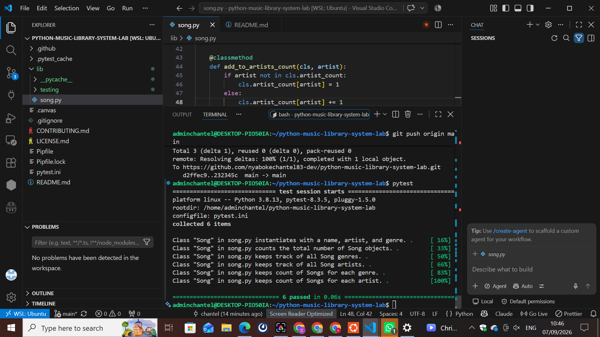

# Music Library System

## Module Lab: Inheritance, Class Attributes, and Class Methods

### Description

This project is a Python Music Library System created to practice Object-Oriented Programming (OOP).

The project focuses on creating a `Song` class and using instance attributes, class attributes, and class methods to keep track of songs, artists, and genres.

## Learning Goals

In this lab, I learned how to:

* Create a Python class.
* Create instance attributes.
* Create class attributes.
* Create class methods using `@classmethod`.
* Keep track of the number of songs.
* Store unique artists and genres.
* Count songs by artist.
* Count songs by genre.
* Run tests using pytest.
* Use Git and GitHub to manage a project.

## Project Structure

```text
python-music-library-system-lab/
│
├── lib/
│   ├── song.py
│   └── testing/
│       └── song_test.py
│
├── README.md
└── pytest.ini
```

## Song Class

The main class in this project is called `Song`.

Each song has three instance attributes:

* `name`
* `artist`
* `genre`

Example:

```python
song = Song("Empire State of Mind", "Jay Z", "Hip Hop")
```

## Class Attributes

The `Song` class contains the following class attributes:

```python
count = 0
genres = []
artists = []
genre_count = {}
artist_count = {}
```

### count

Keeps track of the total number of songs created.

### genres

Stores a list of unique music genres.

### artists

Stores a list of unique artists.

### genre_count

Stores the number of songs for each genre.

Example:

```python
{
    "Hip Hop": 2,
    "R&B": 1
}
```

### artist_count

Stores the number of songs for each artist.

Example:

```python
{
    "Jay Z": 1,
    "Beyonce": 2
}
```

## Class Methods

The project uses class methods to update the class attributes whenever a new song is created.

### add_song_to_count()

Increases the total number of songs by one.

### add_to_genres()

Adds a genre to the genres list if it does not already exist.

### add_to_artists()

Adds an artist to the artists list if the artist does not already exist.

### add_to_genre_count()

Keeps track of how many songs belong to each genre.

### add_to_artists_count()

Keeps track of how many songs belong to each artist.

## Creating a Song

When a new Song object is created, the class attributes are automatically updated.

```python
song = Song("Empire State of Mind", "Jay Z", "Hip Hop")
```

The `__init__` method calls the class methods to update the song count, genres, artists, genre count, and artist count.

## Testing

This project uses `pytest` to test the Song class.

Run the tests using:

```bash
pytest
```

All tests passed successfully:

```text
6 passed
```

## Test Screenshot

Add a screenshot showing the successful tests below:



## Best Practices

The project follows these best practices:

* Used clear class and method names.
* Added comments to explain the code.
* Used class methods to update class attributes.
* Used automated tests to check the functionality.
* Removed unnecessary `__pycache__` files.
* Used Git for version control.
* Developed the Song class on a feature branch.
* Merged the completed feature into the main branch.

## Git Workflow

The Song class was developed using a feature branch:

```bash
git checkout -b feature-song-class
```

After the implementation was completed and all tests passed, the feature was merged into the `main` branch.

The final Git status was clean:

```text
On branch main
Your branch is up to date with 'origin/main'.

nothing to commit, working tree clean
```

## How to Run the Project

Clone the repository:

```bash
git clone https://github.com/nyabokechantel83-dev/python-music-library-system-lab.git
```

Enter the project folder:

```bash
cd python-music-library-system-lab
```

Run the tests:

```bash
pytest
```

## Technologies Used

* Python
* Object-Oriented Programming (OOP)
* Pytest
* Git
* GitHub

## Conclusion

This project helped me practice important Python OOP concepts including classes, objects, instance attributes, class attributes, and class methods.

The Music Library System keeps track of songs, artists, genres, and the number of songs associated with each artist and genre.

All 6 tests passed successfully.
